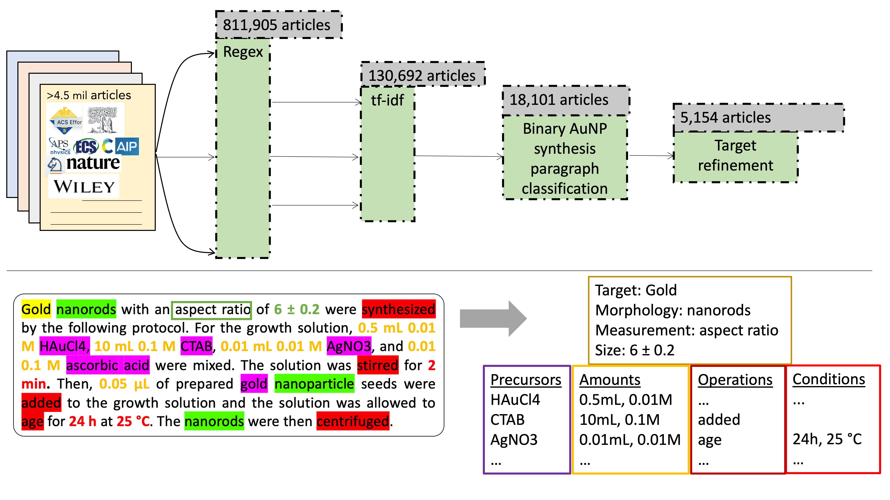

# text-mined-aunp-synthesis_public

Precursors, their amounts, synthesis actions, and resultant particle morphologies and sizes are extracted from the text of 5,154 gold nanoparticle synthesis articles, totaling 7,608 experimental and 12,519 characterization paragraphs. The natural language processing and text mining tools used to collect and codify this information is included in the present repository. The dataset is freely available in .json format.  
